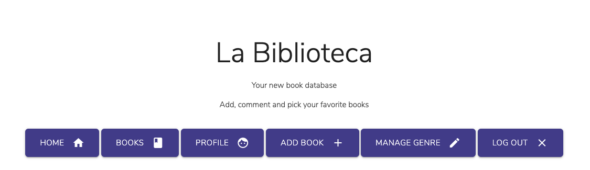

# La Biblioteca

La Biblioteca is a site for book lovers that want to add and share books with family and friends. The users can add new books or add comments to the books added by other members.


The live site can be shared and found in the following [link](https://la-biblioteca-ms3.herokuapp.com/index).

---

## Table of contents

1.[UX](#ux)

* [User Stories](#user-stories)
* [Site owner objectives](#site-owner-objectives)
* [Wireframes](#wireframes)
* [Structure](#structure)
* [Home page](#home-page)
* [ page](#game-page)
* [Contact page](#contact-page)
* [Styling](#styling)
  * [Colours](#colours)
  * [Fonts](#fonts)
  * [Favicon](#favicon)

2.[Features](#features)

* [Existing features](#existing-features)
* [Future features](#future-features)

3.[Technologies used](#technologies-used)

* [Languages](#languages)
* [Libraries](#libraries)
* [Programs and tools](#programs-and-tools)

4.[Testing](#testing)

5.[Deployment](#deployment)

* [GitHub pages](#github-pages)
* [Cloning](#cloning)

6.[Credits](#credits)

* [Content](#content)
* [Media](#media)
* [Acknowledgements](#acknowledgements)
* [I received advice and support from](#user-stories)

<h1> 1. User Experience </h1>

## **User stories**

**As a user I would like to**: |  **So that I could**: |
| ------------- |:-------------:|
| To immediately  understand the purpose  of the page. | search for books and write comments |
| To see all the content without having to register.| enjoy a faster experience |
| To be able to search for keywords. | easily find what I'm looking for. |
| Easily navigate the site | quickly find what I need |
| To be able to register easily without having to input too much information.| register quickly. |
| See books information. | See the book information quickly to decide if I like it. |
| Comment on the different books | share my thoughts with other users. |
| Be able to add books | I can share them with other users |
| Be able to edit the books I added | I can communicate with them |
| Be able to contact the site owner | I can communicate with them |
|||

**As a returner user I would like to**: |  **So that I could**: |
| ------------- |:-------------:|
| Log in and out easily. | Log in everywhere easily. |
| Edit comments. | modify my comment. |
| Check the books I added and marked as favorite. | easily check it out any time. |
| Edit the book I  added | change the information in case I made a mistake |
| Delete the book I added.| delete it. |
| See books information. | See the book information quickly to decide if I like it. |
| Comment on the different books | share my thoughts with other users. |
| Be able to contact the site owner | I can communicate with them |
|||

## **Site owner objectives**

**As a site owner I would like to**: |  **So that I could**: |
| ------------- |:-------------:|
| Delete content added by  the users. | delete anything that shouldn't be there. |
| Add, delete or remove genres. | provide, change or delete them for the users. |
|||

---

## **Wireframes**

The wireframes for this project in different screen sizes can be found below:

* Home page:
  
  
  
* All books page:

  

* Book page:

  

* Login/Sign up page:
  
  

* Add/Edit book:
  
  

---

## **Styling**

### Colours

Using [Colorhunt.co](https://colorhunt.co) I chose a palette with complementary colours that could be found in different sites:

*  `#413B88` - Page name, navbar elements, main buttons, edit button, and add genre and comment.
*  `#675ddb` - Hoover icons and flash messages.
*  `#f44336` - Cancel and delete buttons.

### Fonts

With the fonts the aim was to offer the user a more classic style on the page name as well as the navigation links on the navbar, so that's why I used Halant. For a cleaner and fresher style in the rest of the page Nunito Sans so oit would  offer a modern style that it's easy to read.

### Favicon

One of the emojis available on [Favicon.io](https://favicon.io/emoji-favicons/)

<h1> 2. Features </h1>

## **CRUD operations**

Main purpose of this site was to offer CRUD operations to the user, below listed the functionalities of every part.

### Create

* Users can sign up and create an account.
* Registered users can add books to the database.
* Registered users can add comments.
* The Admin of the site can add Genres.

### Read

* All site users can search and see all books in the database.
* Registered users can see the books they have marked as favorite and also the ones they have added to the database.
* Anyone can see the comments added by other users.
* The genres can be accessed only by the Admin of the page.

### Update

* Books can be edited if the user who added it to the DB logged in.
* Admin can update the different genres.

### Delete

* Books can be deleted by the user who added them to the DB.
* Comments can be deleted by the user who added them.
* The admin can delete the genres.

## **Site features**

### **Structure**

* The aim during the design and development process was to make the site simple and easy for the user to navigate it, finding relevant information and using visual buttons that would help them to use the different functionalities.
* All pages follow the same style and color palette that is simple and focus on the important information.
* The navbar on top of the page is static and have the links to the different pages of the site. It also has the logo. It's responsive on smaller devices.
* The home page has buttons to navigate the different parts of the site as well, the display will be different depending if the user is logged in or not.
* The Books page has a responsive grid display so the user can view the available books easily.
* The book page has a card with all the book information and buttons to mark as favorite, edit or delete the book as well as a comments section.

---

### **Home page**

In the home page the user could find the buttons for the different functionalities on the website. It's in both the navbar and the buttons in the parallax section. The display of the navbar and buttons is different depending on if the user is logged in or not.
If the user is not logged in they will see:

The navbar appears in every page and will display the same categories as showed above in the parallax element.


If the user is not logged in the site will display the following buttons:


If the user is logged in they will see the following (as the user is admin Add Genre is displayed as well)



---

### **All books page**

In this page from top to bottom, the user can look for a particular book in the search bar, there are also two buttons one for searching and another one to clean the search bar.


The user can also view all the available books in a responsive grid. If the user has added the book they could also edit or delete it from that page.


If the cover image of the book is not available a grey background with a fixed height will be showed as well as the book title.


If the user wants to delete a book a modal will show asking for confirmation.


If the user wants to see all the the info on a book they will have to click on the expand button.


---

### **Book page**

Here the user will see a card with all the book information (name, genre, author, pages, ISBN, description and edit/delete buttons).


A button to mark the book as favorite and an add comment button.


If the user is not logged in the comment button will redirect the user to the Sign In/Log In page.

If the comment has been added by the user who is logged in they could also delete it.


---

### **Profile page**

If the user is logged in they will see their name on the top of the page.


As well as the list of books they have marked as favorite and the e books they have added to the database as well.


---

### **Add Book page**

The user can add a new book and will have to input the data through a form. The button is styled following the style of the page so the user experience is easy.


---

### **Edit Book page**

This page displays the same information as the add book one but would retrieve the book information from the DB so the user can see what information is in place at the moment and edit it accordingly.


---

### **Manage genre page**

This page is only visible if the user is logged in as Admin. The genres can be deleted or edited and have buttons following the site style.


Those buttons would lead to the Add Genre that follows the same structure as the Add Book page and likewise for the edit genre page.

When the user is trying to delete a genre a modal will appear so they will confirm they want to delete it.


### **Add Genre page**

The user can add a new book and will have to input the data through a form. The button is styled following the style of the page so the user experience is easy.


### **Buttons and other elements used**

* In the site the same style has been followed as we've seen above. Here in more detail the buttons in both the cards and the book page are the same for a better user experience:

  

  

* When users perform thee following actions a flash message will be displayed:
  * User correctly logged in.
  * Incorrect password or username when user is trying to log in.
  * User registered.
  * Comment added.
  * Comment deleted.
  * Book added.
  * Book edited.
  * Genre added.
  * Genre deleted.
  * Genre edited.
  * Favorite book added to users profile.

    

## Future features

* Pagination
* Threads of comments.
* Share your favorite books.
* Books recommendations.

### Responsive Frontend Design

* Responsive mobile first design using [MaterializeCSS](https://materializecss.com/) framework.
* Jinja2 templates framework for Python for creating the page front-end dynamic content.

### Backend Design

* The site has been created using Python3 and a Flask framework to render the HTML pages.
* The site has been deployed via a Heroku app linked to a GitHub repository.
* The dynamic content is served using a MongoDB database, which is noSQL or document oriented database.

### Website topology

This would be the options users will have depending on if they are logged in or not:

* If the user is not logged in:

  

* If the user is logged in:

  

* If the logged user is the Admin:

  

### Database design

#### **books collection**

| Field Description | Collection Key | Data type |
| --- | --- | --- |
| Unique ID | _id | ObjectId |
| Genre Name | genre_name | String |
| Book Name | book_name | String |
| Book description | book_description | String |
| Book author | book_author | String |
| Book image | book_image | String |
| Number of pages | number_pages | String |
| ISBN number | isbn | String |
| Book added by | created_by | String |

Objects inside the comments array:

| Field Description | Collection Key | Data type |
| --- | --- | --- |
| Unique ID | _id | ObjectId
| User comment| comment | String |
| Comment created by | created_by | String |
|||

#### **genres collection**

| Field Description | Collection Key | Data type |
| --- | --- | --- |
| Unique ID | _id | ObjectId |
| Genre Name | genre_name | String |
|||

#### **users collection**

| Field Description | Collection Key | Data type |
| --- | --- | --- |
| Unique ID | _id | ObjectId |
| Users Name | name | String |
| Username | username | String |
| Password | password | String |
| Books marked as favorite| favorite | Array |

Objects inside the favorites array:

| Field Description | Collection Key | Data type |
| --- | --- | --- |
| Book ID | _id | ObjectId |
| Book Author | book_author | String |
| Genre name | genre_name | String |
|||

<h1> 3. Technologies Used </h1>

## Languages

* [Python3](https://www.python.org/) - Used to create the main application functionality
* [HTML5](https://www.w3schools.com/html/) -  to build the structure of this site.
* [CSS3](https://www.w3schools.com/css/) - to style the page, and fix media queries and the max width.
* [JavaScript](https://www.javascript.com/) - to add interactions with the page.

## Libraries

* [MaterializeCSS](https://materializecss.com/) - Used to design a mobile-first responsive website layout.
* [Flask](https://www.fullstackpython.com/flask.html) - Python web framework
* [Werkzeug](https://werkzeug.palletsprojects.com/en/1.0.x/) - A comprehensive WSGI web application library installed with Flask.
* [PyMongo](https://pymongo.readthedocs.io/en/stable/) - PyMongo is a Python tool for working with MongoDB.
* [Flask-Pymongo](https://flask-pymongo.readthedocs.io/en/latest/) - Flask-PyMongo bridges the gap between Flask and PyMongo.
* [DNSPython](https://www.dnspython.org/) - DNS toolkit for Python
* [click](https://click.palletsprojects.com/en/7.x/) - Python CLI utilities installed with Flask
* [itsdangerous](https://pypi.org/project/itsdangerous/) - Python utility for hash-based message authentication installed with Flask(HMAC, SHA-512)
* [jQuery](https://jquery.com/) - Used to use the JS components of the Materialize elements..
* [Jinja](https://jinja.palletsprojects.com/en/2.11.x/) - Template language for Python.
* [TailwindCSS](https://tailwindcss.com/docs/box-shadow) - For inspiration on the styles for the site.
* [Hover effect](https://ianlunn.github.io/Hover/ ) - For the hover effect on the navbar.

## Programs and Tools

* [VSCode](https://code.visualstudio.com/) - used as IDE for the project.
* [Git](https://git-scm.com/) - used for version control.
* [Github](https://github.com/) - used to host repository and to generate the live website.
* [Google Fonts](https://fonts.google.com) - used for fonts on the site.
* [Balsamiq](https://balsamiq.com/) - used to create the wireframes.
* [Chrome Developer Tools](https://developers.google.com/web/tools/chrome-devtools) - used to test and optimize the site.
* [randomkeygen.com](https://randomkeygen.com/) - Random secure password & keygen generator used to create the Flask SECRET_KEY.

---

<h1> 4. Testing </h1>

The test performed can be found at the [testing.md](testing.md) file.

---

<h1> 5. Deployment </h1>

The website was developed using Visual Studio Code, and using Git pushed to GitHub, that hosts the repository. The site has been deployed on Heroku, the steps to do this would be:

## Cloning La Biblioteca from Github

### Prerequisites

Ensure the following are installed locally on your machine:

* [Python 3.6 or higher](https://www.python.org/download/releases/3.0/)
* [PIP3](https://pypi.org/project/pip/) Python package installer
* [Git](https://git-scm.com/) Version Control

### Cloning the GitHub repository

* Navigate to [CarolinaCobo/la-biblioteca-ms3](https://github.com/CarolinaCobo/la-biblioteca-ms3)
* Click the **Code** button.
* **Copy** the url in the dropdown box.
* Using your favorite **IDE** open up your preferred terminal.
* **Navigate** to your desired file location.

Copy the following code and input it into your terminal to clone la-biblioteca

```
git clone https://github.com/CarolinaCobo/la-biblioteca-ms3.git
```

### Creation of a Python Virtual Environment

* The process may be different depending upon your own OS - please follow this [Python help guide](https://python.readthedocs.io/en/latest/library/venv.html)
to understand how to create a virtual environment*

### Install the App dependencies and external libraries

* In your IDE terminal window, install the dependencies from the requirements.txt file with the following command:

  ```python
  pip3 install -r requirements.txt
  ```

---

### Create the database in MongoDB

*First, you will have to create an account at [MongoDB](https://account.mongodb.com/) to be able to build the database*

* In your MongoDB cluster, create a new database called `la-biblioteca`

* Create the following collections within the new database:

  * books

  
  * users

  
  * genres

  

  Note: MongoDB would assign the ObjectId.

---

### Create `env.py` file

* It should contain at least the following information:

  ```python
  import os

  os.environ.setdefault("IP", "0.0.0.0")
  os.environ.setdefault("PORT", "5000")
  os.environ.setdefault("SECRET_KEY", "YOUR_OWN_SECRET_KEY")
  os.environ.setdefault("MONGO_URI", "YOUR_OWN_MONGODB_URI")
  os.environ.setdefault("MONGO_DBNAME", "YOUR_OWN_MONGODB_DATABASE_NAME")
  ```

* Please ensure you add in your own `SECRET_KEY`, `MONGO_URI` and `MONGO_DBNAME` values.
* **Important:** Add the `env.py` file to your `.gitignore` file before pushing your files to any public git repository.


### Run the application

* To run the application enter the following command into the terminal window:

  ```python
  python3 app.py
  ```

---

## Deploying the app to Heroku

### Create the Heroku App

*Please create at [Heroku](https://signup.heroku.com/login) in order to deploy the app*

* Log in to your Heroku account dashboard and create a new app.
* Enter the name for your app.
  * This needs to be unique and it will flag is the name is already in use so choose can a suitable alternative name for your own App.
* Choose a geographical region closest to where you are located.
  * Options available on a free account are **United States** or **Europe**

---  

### Push your repository to GitHub

* Commit and push your local repository to your GitHub linked repository.

* Ensure your local git repository has the following files in the root directory:

  * Heroku `Procfile`
  * `requirements.txt`

* If these are not showing in your local Git repository for any reason, enter the following commands in the terminal window:

  ```python
  echo web: python app.py > Procfile
  pip3 freeze --local > requirements.txt
  ```

* Stage, commit and push your local Git repository to GitHub

---

### Connect Heroku to GitHub

* In the Heroku App Settings page, open the tab *Config Vars*
* Add all the environment variables from your local `env.py` file into the Heroku Config Vars:

| Key | Value |
| --- | --- |
| IP | 0.0.0.0 |
| PORT | 5000 |
| SECRET_KEY | YOUR_OWN_SECRET_KEY |
| MONGO_URI | YOUR_OWN_MONGODB_URI |
| MONGO_DBNAME | YOUR_OWN_MONGODB_DATABASE_NAME |
|||

* In the Heroku App Deploy page:
  * Select GitHub from the Deployment Method options.
  * Select Connect to GitHub.
  * Log in to your GitHub account from Heroku to link the App to GitHub.
  * Search for and select the repository to be linked in Github.
  * Select Connect.
  * Select Enable Automatic Deployment from the GitHub Master / Main branch

### Launch the App

* Click Open App in Heroku to launch the App in a new browser window.

<h1> 6. Credits </h1>

## Content

This project JS part was following the Code Institute Task Manager Miniproject with some changes of my  own,

## Media

* The color palette used in this site was obtained from [Colorhunt.co](https://colorhunt.co)
* The favicon for this site has been resized in [Favicon.io](https://favicon.io/)
* The Library [Tailwind](https://tailwindcss.com/) has been used for inspiration on styles.
* Icons are from [Hero Icons](https://heroicons.com/).
* Book images are from [Easons](https://www.easons.com/)
* Parallax image is from [Unplash](https://unsplash.com/)

All the book image URLs and books descriptions, number of pagese and ISBN numbers were sourced from Easons online bookstore from their CDN image delivery URLs and used purely for educational purposes only to demonstrate the app backend CRUD functionality. Please visit Easons for great deals on books.


<h1> 7. Acknowledgements </h1>

I received inspiration for this project from:

* [MDN Documentation](https://developer.mozilla.org/en-US/)
* [Easons](https://www.easons.com/) 
* [W3Schools](https://www.w3schools.com/)
* [CSS-Tricks](https://css-tricks.com/)
* [StackOverflow](https://stackoverflow.com/)
* [Codú Community](https://www.youtube.com/channel/UCvI5azOD4eDumpshr00EfIw)
* [FreeCodeCamp](https://www.freecodecamp.org/)
* [Simon Vardy](https://github.com/simonjvardy), Code Institute student.

### I received advice and support from

* [Niall Maher](https://www.linkedin.com/in/nialljoemaher/?originalSubdomain=ie)
* [Codú Community](https://discord.com/invite/NxSkYtZ)
* My mentor [Precious Ijege](https://www.linkedin.com/in/precious-ijege-908a00168/)
* Code Institute [Slack Community](code-institute-room.slack.com)
