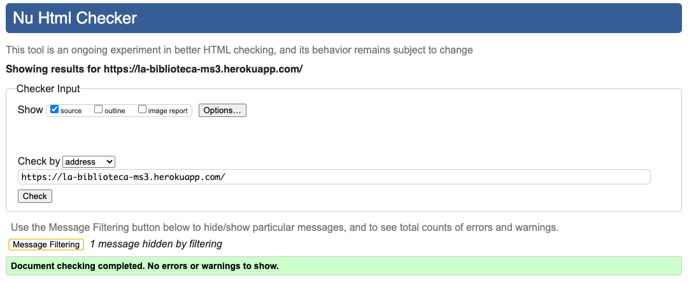
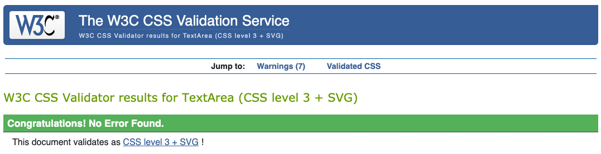
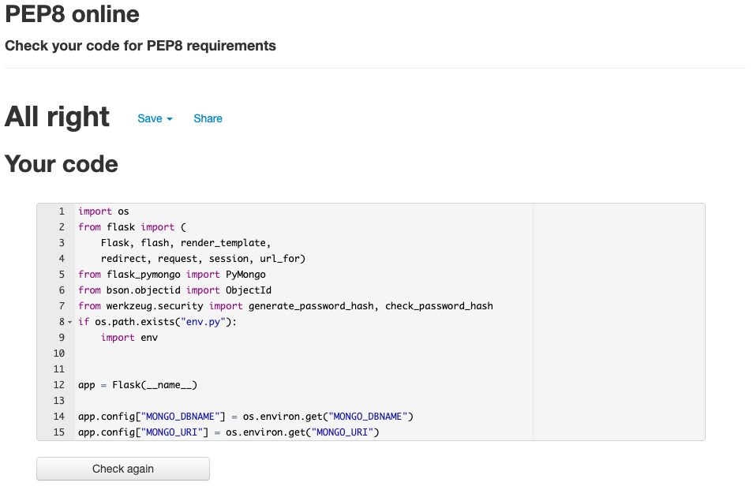
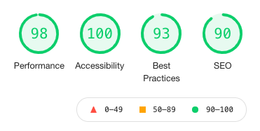

# La Biblioteca - Testing

[View the live project here.](https://la-biblioteca-ms3.herokuapp.com/)

## Table of Contents

*[La BibliotecaProject Testing Details](#t)

  *[Table of Contents](#table-of-contents)
  *[Automated Testing](#automated-testing)
    *[Validation Services](#validation-services)

  *[Manual Testing](#manual-testing)
    *[Unit Testing](#unit-testing)
    *[Testing undertaken on desktop](#testing-undertaken-on-desktop)
    *[Testing undertaken on tablet and phone devices](#testing-undertaken-on-tablet-and-phone-devices)
  *[Bugs discovered](#bugs-discovered)
      *[Known Bugs](#known-bugs)
      *[Unsolved Issues](#unsolved-issues)

## Code Validation

### Validation Services

To validate the code the following **validation services** and **linters** were used to check the code:

* [W3C Markup Validator](https://validator.w3.org/)
    Checks the markup validity of Web documents in HTML, XHTML, SMIL, MathML, among others.
    

* [W3C CSS Validation Service](https://jigsaw.w3.org/css-validator/)
    Checks the validity of cascading style sheets (css) and (X)HTML documents with style sheets.
    

* [PEP8 Online validation](http://pep8online.com/checkresult)
    This linter checks the validity of Python code against the PEP8 requirements
    

* [Chrome DevTools Lighthouse](https://developers.google.com/web/tools/lighthouse)
    An open-source automated tool for improving webpages by running audits for performance, accessibility, progressive web apps, SEO etc.

    

## Manual Testing

### Unit Testing

All the site has been tested and all the steps have been documented, it can be found in the [Unit Testing document](https://drive.google.com/file/d/1eBxfC-XzAlOhbvxMPc1ZTM2ME3GABF90/view?usp=sharing)

### Devices and browsers

**Browser versions used in testing:**

* Google Chrome Version 89.0.4389.114 (Official Build) (x86_64).
* Safari Version 14.0.3 (16610.4.3.1.7).
* Firefox Version 87.0 (64-bit)

**Tested on the following devices using the Google Chrome Developer tools:**

* Moto G4
* Galaxy S5
* Pixel 2
* Pixel 2 XL
* iPhone 5/SE
* iPhone 6/7/8
* iPhone 6/7/8 Plus
* iPhone X
* iPad
* iPad Pr
* Surface Duo
* Galaxy Fold

**Tested on the following devices using the Firefox Developer tools:**

* Galaxy S9/S9+ Android 7.0
* iPad
* iPhone 6/7/8 iOS 11
* iPhone 6/7/8 plus iOS 11
* iPhone x/XS iOS 12
* Kindle Fire HDX Linux

**Tested on the following physical devices:**

* iPhone XS
* iPhone 12
* Samsung S20
* iPad Pro 12.9 2nd generation

## Bugs discovered

#### Known Bugs

#### Unsolved Issues

